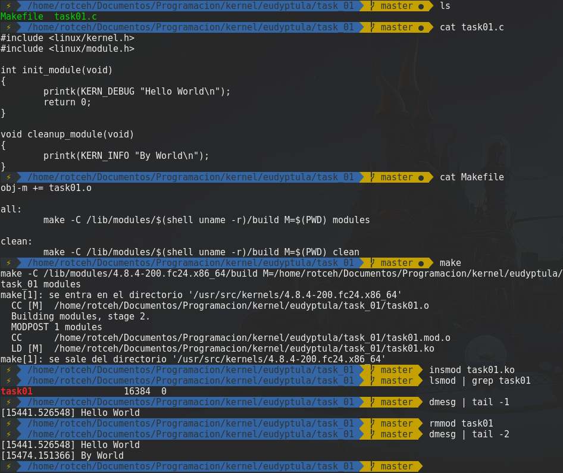

# [ [Task 01](https://github.com/hectorriesco/kernel/tree/master/eudyptula/task_01/) ] First kernel module

## Hello World kernel implement:



## The commands that i use are:

    ```
        make
        insmod task01.ko
        lsmod | grep task01
        dmesg | tail -1
        rmmod task01
        dmesg | tail -2
        make clean    
    ```
